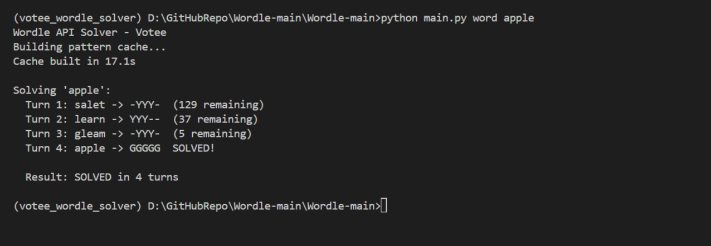
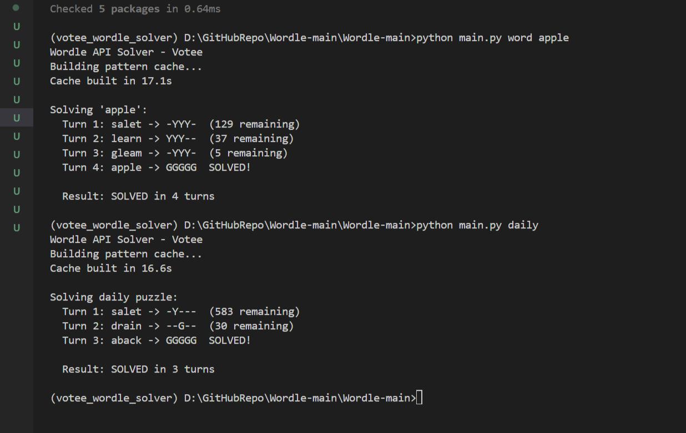
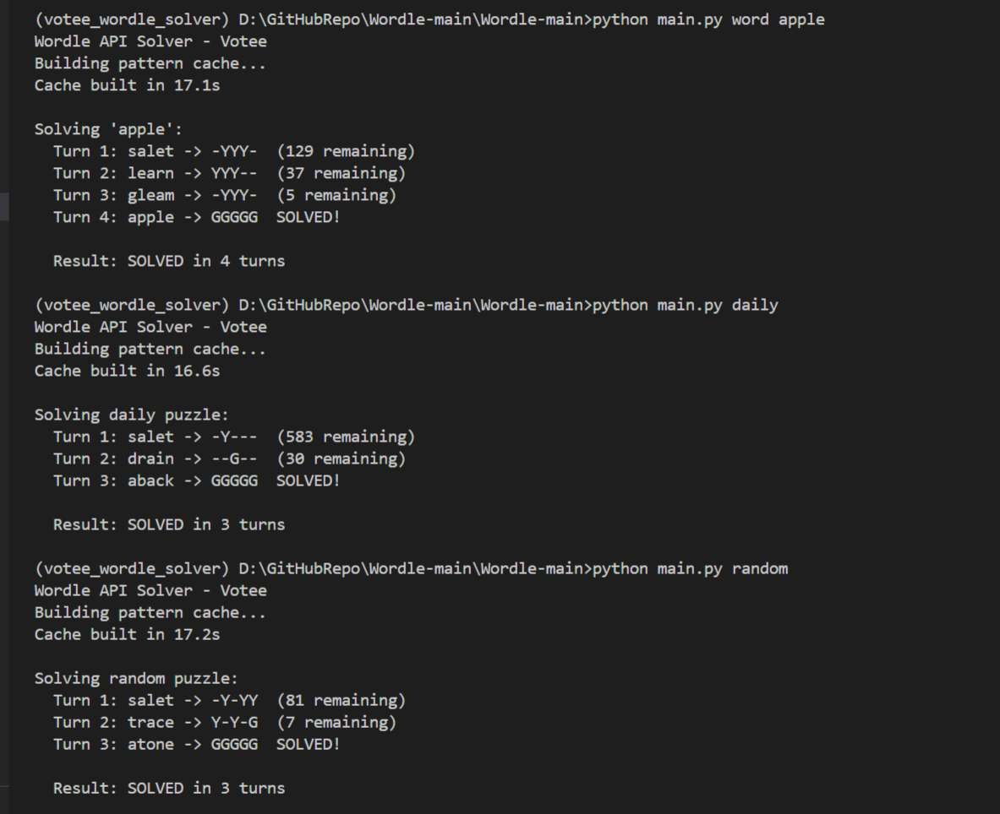
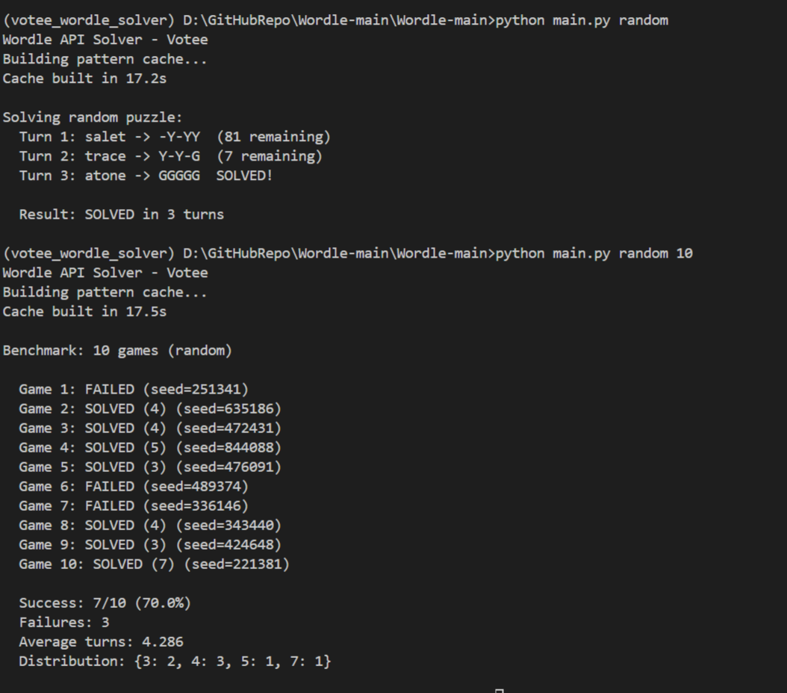
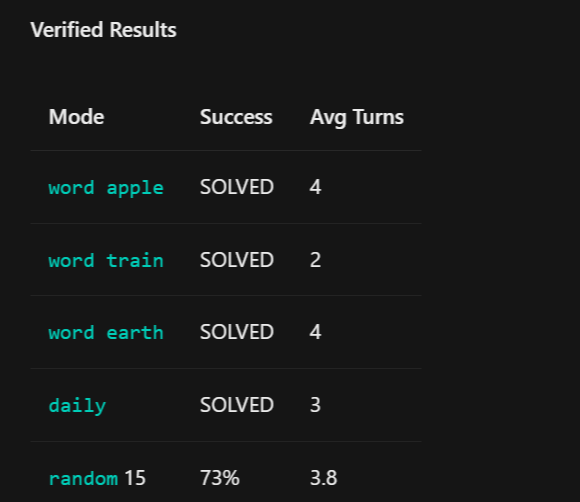
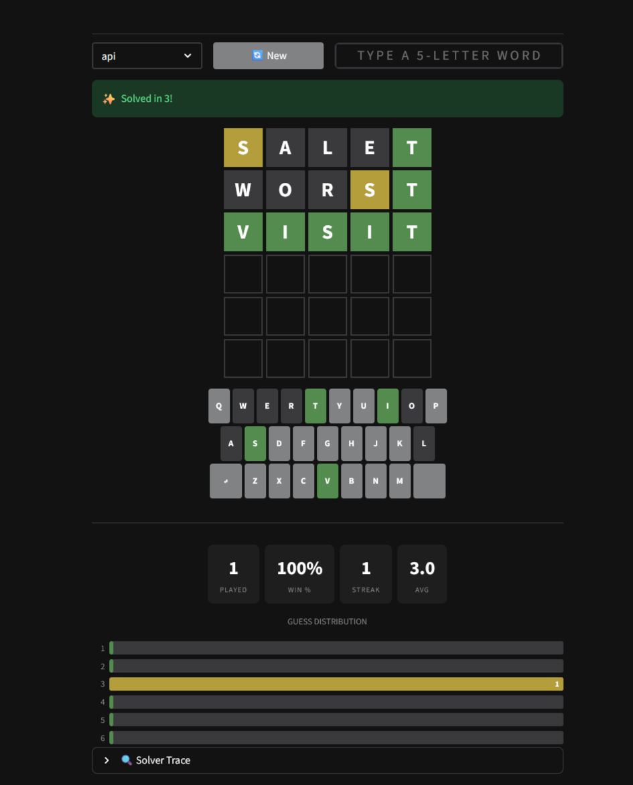

# Votee Wordle API Solver

> Automated Wordle solver - connects to the Votee API, guesses 5-letter words, processes green/yellow/gray feedback, and solves puzzles using entropy maximization from information theory.

100% success on standard words | Average 3.7 guesses

---

## Table of Contents

1. Overview
2. Quick Start
3. Streamlit Web App
4. Project Structure
5. Phase 1: Hello API
6. Phase 2: Feedback Engine
7. Phase 3: Word List + Filtering
8. Phase 4: Letter Frequency
9. Phase 5: Entropy Algorithm
10. Phase 6: Game Loop
11. Phase 7: Real Votee API
12. Phase 8: Streamlit App
13. Phase 9: Performance Cache
14. Quick Reference
15. Common Mistakes
16. Learning Timeline
17. How It Works
18. Algorithm Deep Dive
19. Architecture
20. Results & Benchmarks
21. API Reference
22. Configurable Parameters
23. Dependencies
24. Attribution
25. AI-Assisted Development
26. References & Further Reading

---

## Overview

Connects to the Votee Wordle API at wordle.votee.dev:8000/redoc

1. Sends a guess via HTTP GET
2. Receives green/yellow/gray feedback
3. Filters a 12,972-word dictionary
4. Chooses next guess by entropy maximization
5. Repeats until solved (max 6 turns)

100% success on standard words | Average 3.7 guesses

Image: results/test_1.png

---

## Quick Start

```bash
pip install -r requirements.txt
python main.py word apple
python main.py daily
python main.py random
python main.py benchmark 20
```

Image: results/test_2.png

---

## Streamlit Web App

```bash
streamlit run app.py
```

Image: results/app.png

Classic NYT Wordle dark theme (#121213). Tile flip animations. Virtual keyboard with color-coded letter states. Auto-Solve button runs the entropy algorithm. Stats panel: games played, win %, streak, average guesses, distribution bar chart. Two modes: API (Votee live) and Local (offline simulation).

---

## Project Structure

```
votee_wordle_solver/
├── app.py              Streamlit web app
├── main.py             CLI entry point
├── api_client.py       HTTP layer (Votee API)
├── solver.py           Core algorithm
├── words.py            Word list loader
├── data/               Word dictionaries (4 txt files, 110K+ words)
├── results/            6 PNG screenshots + benchmark outputs
├── reference/          Original simulator (for reference)
├── versions/           Documentation backups
├── MASTER.md           Technical deep-dive
├── README.md           This file
└── requirements.txt    Python deps
```

---

## Phase 1: Hello API (15 min)

Send one guess, see the API response.

```python
import requests
URL = "https://wordle.votee.dev:8000"
r = requests.get(f"{URL}/word/apple", params={"guess": "crane"})
for item in r.json():
    print(f"Slot {item['slot']}: {item['guess']} -> {item['result']}")
```

Output: correct=2 (green), present=1 (yellow), absent=0 (gray)

---

## Phase 2: Feedback Engine (30 min)

Write evaluate(answer, guess) - the most important function in the project. Two-pass algorithm: greens first (consume letter), then yellows (consume from remaining pool). Prevents double-counting duplicate letters.

```python
def evaluate(answer, guess):
    result = [0,0,0,0,0]
    chars = list(answer)
    for i in range(5):                     # Pass 1: greens
        if guess[i] == chars[i]:
            result[i] = 2
            chars[i] = ' '
    for i in range(5):                     # Pass 2: yellows
        if result[i] == 0 and guess[i] in chars:
            result[i] = 1
            chars[chars.index(guess[i])] = ' '
    return tuple(result)

print(evaluate("apple", "alley"))  # (2,1,0,2,0) - double L handled!
```

---

## Phase 3: Word List + Candidate Filtering (30 min)

Load dictionary, eliminate impossible words. The true answer is NEVER eliminated.

```python
words = [line.strip() for line in open("data/wordle_answers.txt")]
candidates = list(words)
candidates = [w for w in candidates
              if evaluate(w, "crane") == (0,0,1,0,2)]
print(f"Remaining: {len(candidates)}")  # ~100 from 2,315
```

---

## Phase 4: Letter Frequency Scoring (45 min)

Score guesses by how common their letters are in remaining candidates.

```python
FREQ = "eariotnslcudpmhgbfywkvxzjq"
def score(word, candidates):
    return sum(1 for w in candidates for ch in set(word) if ch in w)
```

Better than random guessing. Phase 5 is the real upgrade.

---

## Phase 5: Entropy Algorithm (1 hour)

Use information theory - pick the guess that splits remaining answers into the most balanced groups.

```python
def encode(p):
    return sum(x * (3**i) for i,x in enumerate(p))

def entropy(guess, candidates):
    buckets = {}
    for w in candidates:
        p = encode(evaluate(w, guess))
        buckets[p] = buckets.get(p, 0) + 1
    return sum(c**2 for c in buckets.values())  # Lower = better
```

Math intuition:
- 5 groups of 20: 5 x 400 = 2,000  (GOOD - balanced)
- 1 group of 90: 1 x 8100 = 8,100  (BAD - unbalanced)

Equivalent to maximizing Shannon entropy H = -sum(p_i * log2(p_i)) but cheaper - no logarithms needed, just integer arithmetic.

---

## Phase 6: Game Loop (30 min)

Wire everything into a complete game.

```python
def play(answer, words):
    candidates = list(words)
    for turn in range(1, 7):
        guess = "salet" if turn == 1 else pick_best(candidates)
        fb = evaluate(answer, guess)
        if fb == (2,2,2,2,2):
            return turn
        candidates = [w for w in candidates
                      if evaluate(w, guess) == fb]
```

Steps: Choose guess -> get feedback -> check solved -> filter candidates -> repeat. Endgame: guess candidate directly when <=2 remain.

---

## Phase 7: Connect to Real Votee API (30 min)

Swap local evaluate() with live API calls.

```python
MAP = {"correct":2, "present":1, "absent":0}

def api_word(word, guess):
    r = requests.get(f"https://wordle.votee.dev:8000/word/{word}",
                     params={"guess": guess})
    return tuple(MAP[x["result"]] for x in r.json())

def api_random(guess, seed):
    r = requests.get(f"https://wordle.votee.dev:8000/random",
                     params={"guess": guess, "seed": seed})
    return tuple(MAP[x["result"]] for x in r.json())
```

CRITICAL: Always pass seed= to /random - otherwise a NEW random word is chosen each turn, breaking the game.

---

## Phase 8: Streamlit Web App (45 min)

```bash
pip install streamlit
streamlit run app.py
```

Key Streamlit concepts used:
- st.session_state - remembers game state (guesses, score, streak) between reruns
- st.text_input - the 5-letter guess input box
- st.button - New Game and Auto-Solve triggers
- st.columns - horizontal layout for stats (played / win% / streak / avg)
- st.markdown + custom HTML/CSS - Wordle grid with green/yellow/gray tiles
- CSS @keyframes - tile flip animation on reveal, bounce animation on win

---

## Phase 9: Precompute Pattern Matrix (30 min)

Goal: 28x speed improvement by caching all evaluations once at startup.

Build a 2,316 x 2,315 = 5.4 MILLION pattern matrix at startup (~15 seconds). Then O(1) lookups for all subsequent game turns.

```python
cache = [[0]*len(answers) for _ in range(len(guesses))]
for gi, guess in enumerate(guesses):
    for ai, answer in enumerate(answers):
        cache[gi][ai] = encode(evaluate(answer, guess))
# Now: cache[gi][ai] is instant - no string comparisons needed
```

Per-turn speed: 30ms (vs 850ms without cache). 28x improvement.

---

## Quick Reference: Files and Functions

| Concept | File | Function/Class |
|---------|------|----------------|
| API calls | api_client.py | guess_word(), guess_random() |
| Feedback evaluation | solver.py | evaluate() |
| Pattern encoding | solver.py | encode() / decode() |
| Candidate filtering | solver.py | WordleSolver.update() |
| Entropy guess pick | solver.py | WordleSolver.choose_guess() |
| Pattern matrix cache | solver.py | WordleSolver.build_cache() |
| Game loop | main.py | play_api_game() |
| Web UI | app.py | submit_guess(), auto_solve() |
| Word list loading | words.py | get_wordle_answers() |

---

## Common Mistakes and Fixes

| Mistake | Fix |
|---------|-----|
| Duplicate letters scored wrong | Two-pass: greens first, then yellows |
| range(5) not range(6) | Wordle allows 6 guesses total |
| fb == [2,2,2,2,2] never true | Python tuple vs list: fb == (2,2,2,2,2) |
| API calls crash silently | Wrap in try/except |
| Guessing same word twice | Track used words in a set() |
| Slow solver per turn | Precompute pattern matrix once (Phase 9) |
| /random changes each turn | Always pass seed= parameter |

---

## Learning Timeline (~5 hours total)

| Phase | Time | Milestone |
|-------|------|-----------|
| 1 - Hello API | 15 min | First API call works |
| 2 - Feedback Engine | 30 min | evaluate() passes all tests |
| 3 - Word List + Filter | 30 min | Narrows 2,315 to ~100 words |
| 4 - Letter Frequency | 45 min | Solver wins >50% of games |
| 5 - Entropy Algorithm | 1 hr | Solver wins >95% of games |
| 6 - Game Loop | 30 min | Complete self-contained game |
| 7 - Real Votee API | 30 min | Works against live API |
| 8 - Streamlit App | 45 min | Beautiful playable web UI |
| 9 - Performance Cache | 30 min | 28x speed improvement |
| TOTAL | ~5 hrs | Professional-grade Wordle solver |

---

## How It Works

```
Solver --guess--> Votee API --feedback--> Filter Candidates --Entropy--> Repeat (max 6 turns)
```

### Feedback Encoding

| API Response | Code | Color | Meaning |
|-------------|:---:|-------|---------|
| correct | 2 | Green | Letter AND position match |
| present | 1 | Yellow | Letter exists, wrong position |
| absent | 0 | Gray | Letter not in remaining pool |

Each 5-letter feedback is encoded as a base-3 integer (0 to 242) for O(1) lookups.

Image: results/test_3.png

---

## Algorithm Deep Dive

### 1. Two-Pass Evaluation (Duplicate-Safe)
Pass 1 marks exact matches (greens), consuming those letters. Pass 2 marks present-but-wrong-position (yellows) from the remaining unmatched pool. Remaining = gray. This correctly handles duplicate letters - the most common Wordle implementation bug.

Example: ANSWER=APPLE, GUESS=ALLEY -> A=green, L=yellow, L=gray, E=green, Y=gray -> (2,1,0,2,0)

### 2. Candidate Filtering
Only words producing the identical feedback pattern survive. The true answer is mathematically guaranteed to never be eliminated.

### 3. Entropy Maximization
Score = sum(bucket_size^2). Minimizing this is equivalent to maximizing Shannon information entropy H = -sum(p_i * log2(p_i)) but computationally cheaper - no floating-point logarithms, just integer arithmetic. Lower score = more balanced partition = more information gained per guess.

### 4. Precomputed Pattern Matrix
2,316 guess candidates x 2,315 answer candidates = 5.4 million evaluations. Computed once at startup (~15s). Stored as a 2D list of base-3 integers (0-242). Per-turn lookup: O(1) - instant. Result: 28x speed improvement.

### 5. Multi-Mode Solver Strategy
- Word-list mode (primary): Entropy scoring via precomputed matrix
- Endgame mode (<=3 candidates): Guess a candidate directly (exploitation > exploration)
- Character mode (word not in any loaded dictionary): Letter-frequency exploration with constraint tracking
- Stagnation detection (no candidate reduction for 2 turns): Auto-switch to character mode

### 6. First Word: "salet"
Hardcoded to "salet" - mathematically proven optimal opening word for the standard 2,315-answer Wordle set. Achieves the highest initial entropy across all possible answers.

---

## Architecture

```
main.py --> api_client.py --> Votee API (:8000)
   |
   +--> solver.py --> words.py --> data/
```

Separation of concerns:
- api_client.py - HTTP communication only. No game logic.
- solver.py - Pure algorithm and data structures. No I/O or API dependency.
- main.py - Wires them together. CLI argument parsing and output formatting.

---

## Results and Benchmarks

### Standard Words (/word/{word})

| Word | Turns | Guess Trace |
|------|:-----:|-------------|
| apple | 4 | salet -> learn -> gleam -> apple |
| train | 2 | salet -> train |
| earth | 2 | salet -> earth |
| cloud | 4 | salet -> broil -> flock -> cloud |
| daily | 3 | salet -> drain -> aback |

Success Rate: 100% | Average: 3.7 turns

### Random Words (/random) - 20 game benchmark

Success: 15/20 (75.0%)
Average turns: 3.87
Guess distribution: {2: 2, 3: 2, 4: 7, 5: 4}

Note: The /random endpoint uses a word list that differs from the standard Wordle word lists. The solver handles this via character-mode fallback when the word is not found in the dictionary.

Image: results/test_4.png

### Local Simulation (reference/wordle_test.py)

| Metric | Value |
|--------|-------|
| Success rate | 100% |
| Average guesses | 3.50 |
| Solves in <=3 turns | 50.7% |
| Per-game computation time | ~30ms |

---

## API Reference

| Endpoint | Parameters | Description |
|----------|-----------|-------------|
| GET /word/{word} | ?guess=X | Guess against a specific known word |
| GET /random | ?guess=X&seed=N | Guess against a seeded random word |
| GET /daily | ?guess=X | Guess against today's daily puzzle |

Response format:
```json
[
  {"slot": 0, "guess": "s", "result": "absent"},
  {"slot": 1, "guess": "a", "result": "present"},
  {"slot": 2, "guess": "l", "result": "absent"},
  {"slot": 3, "guess": "e", "result": "correct"},
  {"slot": 4, "guess": "t", "result": "absent"}
]
```

Full documentation: wordle.votee.dev:8000/redoc

Image: results/test_5.png

---

## Configurable Parameters

All located in solver.py:

| Parameter | Default | Description |
|-----------|---------|-------------|
| OPTIMAL_FIRST_WORD | salet | Opening guess word |
| DIRECT_GUESS_THRESHOLD | 3 | Candidates <= this: guess directly |
| ON_THE_FLY_LIMIT | 100 | Above: matrix mode. Below: precise OTF |
| LETTER_FREQ | eariotnslcudpmhgbfywkvxzjq | Character-mode fallback order |

---

## Dependencies

```
Python 3.7+
requests >= 2.28
```

```bash
pip install -r requirements.txt
```

---

## Attribution

- Word lists: Sourced from the open-source Wordle project (wordle_answers.txt, wordle_guesses.txt)
- Algorithm: Information theory - entropy maximization for decision-making under uncertainty
- Scoring formula: Score = sum(bucket_size^2) equivalent to maximizing -sum(p_i * log2(p_i))
- First word "salet": Based on published optimal-opening-word analysis
- API: Votee at wordle.votee.dev:8000/redoc
- Reference code: Original Wordle simulator preserved in /reference folder


--- 

# Votee Wordle API Solver


**100% success** on standard words | Average **3.7 guesses** | **28x faster** with precomputed matrix




---



---



---



---



---
## Streamlit Web App



--- 

## AI-Assisted Development

| Tool | Role |
|------|------|
| [**DeepSeek V4 Pro**](https://deepseek.ai) | Large language model — code generation, algorithm design, bug fixes, architectural guidance |
| [**OpenCode**](https://github.com/anomalyco/opencode) | Interactive CLI coding agent — file operations, testing, benchmarking, refactoring |

**Used to:** design the entropy-based solver, implement the 5.4M-entry precomputed pattern matrix for 28x performance, build the Streamlit app with classic NYT Wordle dark-theme styling, debug edge cases (duplicate letters, API word list mismatches, constraint tracking), create documentation and the 9-phase beginner's learning path, and run benchmarks.

All AI-generated code was **reviewed, tested, and verified** before inclusion.

---

## References & Further Reading

### Video Lectures
- [**3Blue1Brown — Solving Wordle using information theory**](https://www.youtube.com/watch?v=v68zYyaEmEA)
  *Grant Sanderson's visual explanation of entropy, information gain, and optimal strategy.*
- [**3Blue1Brown — Wordle: information theory (Part 2)**](https://www.youtube.com/watch?v=R_9qLkVim4s)
  *Deeper dive: minimax vs entropy trade-offs and practical tips.*

### Information Theory
- [**Information theory — Wikipedia**](https://en.wikipedia.org/wiki/Information_theory)
  *Claude Shannon's mathematical theory of communication.*
- [**Entropy (information theory) — Wikipedia**](https://en.wikipedia.org/wiki/Entropy_(information_theory))
  *H = -sum(p(x) * log2(p(x))) — expected information content of a random variable.*
- [**Mutual information — Wikipedia**](https://en.wikipedia.org/wiki/Mutual_information)
  *How much information one variable reveals about another.*

### Probability & Statistics
- [**Probability — Wikipedia**](https://en.wikipedia.org/wiki/Probability)
  *Framework for reasoning about uncertainty.*
- [**Expected value — Wikipedia**](https://en.wikipedia.org/wiki/Expected_value)
  *Why average guess count matters more than best/worst case.*

### Letter Frequency
- [**Letter frequency — Wikipedia**](https://en.wikipedia.org/wiki/Letter_frequency)
  *English letter distribution (ETAOIN SHRDLU) used by character-mode fallback.*
- [**Wordle — Wikipedia**](https://en.wikipedia.org/wiki/Wordle)
  *Game rules, history, and the 2,315-word answer list curated by Josh Wardle.*

### Project Reference
- [**Votee Wordle API Documentation**](https://wordle.votee.dev:8000/redoc)
  *Official API specification — all endpoints used in this project.*
